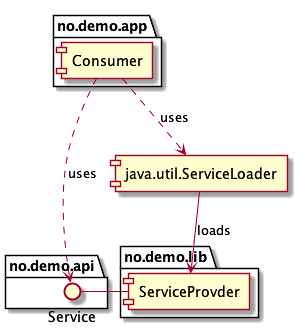

Intro til
### Java Platform Module System
### (JPMS)

---

Note:
- Project Jigsaw ble introdusert i Java 9 i 2017.
- Jeg har brukt JPMS i to prosjekter, andre som har brukt JPMS?
- Det tok ca 10 år å modularisere selve JDK-en: Drøyt 100 moduler.


---

@snap[north-west]
### Project Jigsaw: To hovedmål
@snapend
@ul[list-spaced-bullets text-white text-09]
- Sterkere innkapsling av koden
- Sterkere kontroll av avhengigheter
@ulend


---
@snap[north-west]
### Hva er en modul?
@snapend

JAR + moduldeskriptor


---
@snap[north-west]
### Moduldeskriptor
@snapend

@snap[west]
@ul[list-spaced-bullets text-white text-09]
- Java-kode
- Unikt navn
- Må ligge på rota 
@ulend
@snapend

Note:
- Revers domenenavn er vanlig å bruke.
- En modul må ha en universelt unikt navn.
- Moduldeskriptor må ligge på rot-pakken. 


---
@snap[north-west]
### Moduldeskriptor
@snapend

@snap[west]
@ul[list-spaced-bullets text-white text-09]
- `requires` -> Moduler denne modulen er avhengig av
- `uses` -> Tjenester denne modulen bruker
- `exports` -> Pakker som er tilgjengelige
- `provides` -> Tjenester denne modulen tilbyr
- `opens` -> Pakker åpne for reflection
@ulend
@snapend

Note:
- Dette er java-kode som kompileres: Introduserer 5 nye Java nøkkelord.


---
@snap[north-west]
### Moduldeskriptor
@snapend

```java
module no.demo.core.user.authentication {

    requires oauth2.oidc.sdk;
    requires spring.web;

    requires no.demo.log;
    requires no.demo.configuration;
    requires no.demo.engine;

    exports no.demo.core.user.authentication.api;

    provides ConfigurationProperties
            with Configuration;

    // Open config to be read by the configuration library.
    opens no.demo.core.user.authentication.configuration
            to no.demo.configuration;
}
```


---
@snap[north-west]
### Lasting av klasser
@snapend

Klasser lastes fra module path, ikke fra classpath

`java --module-path <module directory> --module no.demo.app/no.demo.app.Main` 

---
@snap[midpoint]
### Hva er nytteverdien i praksis?
@snapend


---
@snap[north-west]
### Nytteverdi: To viktige mål
@snapend

@snap[west]
@ul[list-spaced-bullets text-white text-09]
- *Sterkere innkapsling*: 
  - Vedlikeholdbarhet
  - Sikkerhet
- *Sterkere kontroll av avhengigheter*: Module path i compile- _og_ launchtime
@ulend
@snapend

Note:
- Ad 1: Kun eksporterte klasser som er public er tilgjengelige utenfra. Public/package/protected klasser som ikke er eksporterte er IKKE tilgjengelige.
- Ad 1: - Den sterke innkapslingen vil ikke gjøre det så enkelt å ta snarveier, dvs lage unødvendige avhengheter, tidlig i et prosjekt.
- Ad 1, sikkerhet: Kritisk kode er skjult for annen kode som ikke `requires` den, og det håndheves både i compile- og runtime.
- Ad 2: Vha module-path dannes en graf av moduler (i både compile- og runtime) som både javac/java kan forholde seg til, ikke bare en haug med klasser (classpath).


---
@snap[north-west]
### Nytteverdi: Oppstart av applikasjon
@snapend

Kan få raskere oppstart, viktig i containerbaserte miljø.

Note:
- Søk etter, og lasting av, klasser sannsynligvis vil gå raskere, siden en modulgraf settes opp ved oppstart.
- Mest aktuelt for store applikasjoner.


---
@snap[north-west]
### Nytteverdi: Frikobling mellom moduler
@snapend

@snap[west]
Full frikobling mellom moduler vha tjenester:<br>
Gir mulighet for «plugin-arkitektur» 
@snapend



Note:
- Ad 1: Instansierer tjenester typisk med en factory. Gir kun avhengighet til eksporterte pakker, som gjerne kan være en pakke no.firma.modul.api med interfaces.
- Ad 2: En tjeneste defineres gjerne som et interface i en API-modul.
- Ad 2: Laste instans av et tjeneste med java.util.ServiceLoader. 
- Ad 2: Hvilke moduler som skal deployes til et gitt miljø kan settes opp i en eller flere separate bootstrap-moduler.


---
@snap[north-west]
### Erfaringer
@snapend

@snap[west]
@ul[list-spaced-bullets text-white text-09]
- Verktøystøtte og tredjepartsbiblioteker er ikke _veldig_ modne for JPMS ennå.
- Maven er klargjort for JPMS fra starten av. 
- Testing blir annerledes/vanskeligere på grunn av den sterke innkapslingen. En del testing med classpath i stedet for module path pga begrensninger i tredjepartsbiblioteker.
@ulend
@snapend

Note: 
- Vi har benyttet JPMS-moduler i to prosjekter: Ett er i produksjon og det andre er under utvikling. Det er altså litt tidlig å si hva som er nytteverdien, men arkitekturen i systemene er tydelig påvirket av JPMS.
- Ad 2: Det vil si at Maven plugins (compiler, surefire, failsafe) «skjønner» og bruker modulepath.


---
@snap[north-west]
### Lenker
@snapend

@snap[west]
@ul[list-spaced-bullets text-white text-09]
- Oversikt over biblioteker i Maven Central med JPMS modulnavn (gyldige og ugyldige) finnes på https://github.com/sormuras/modules.
- Artikkel om testing: https://sormuras.github.io/blog/2018-09-11-testing-in-the-modular-world.html.
- Blog om (bl.a.) JPMS: https://blog.codefx.org/tag/jpms/
- Bok: https://www.manning.com/books/the-java-module-system 
@ulend
@snapend

Note:
- Artikkel: https://sormuras.github.io/blog/2018-09-11-testing-in-the-modular-world.html. 