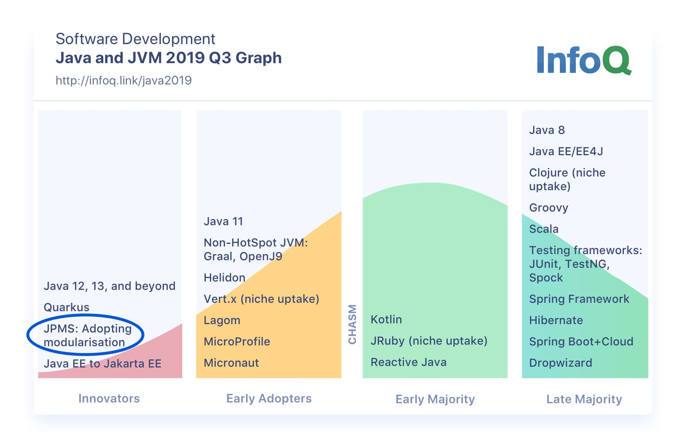

Intro til JPMS
### Java Platform Module System

---

---

@snap[north-west]
### To viktige mål
@snapend
@ul[list-spaced-bullets text-white text-09]
- Sterkere innkapsling av protected/package klasser/metoder i et bibliotek.
- Sterkere kontroll av avhengigheter mellom biblioteker.
@ulend

---
@snap[north-west]
### Hva er en modul?
@snapend

JAR + moduldeskriptor

---
@snap[north-west]
### Moduldeskriptor
@snapend

En modul må ha en universelt unikt navn. (Revers domenenavn er vanlig å bruke.)

---
@snap[north-west]
### Moduldeskriptor
@snapend

@snap[west]
@ul[list-spaced-bullets text-white text-09]
- `requires` Hvilke andre moduler er denne modulen avhengig av.
- `uses` Hvilke tjenester bruker denne modulen.
- `exports` Hvilke pakker er tilgjengelige utenfor denne modulen.
- `provides` Hvilke tjenester tilbyr denne modulen.
- `opens` Hvilke pakker åpner denne moduler for bruk av reflection fra andre biblioteker (kan kvalifiseres).
@ulend
@snapend

---
@snap[north-west]
### Moduldeskriptor
@snapend

Eksempel:
(TODO: Eksempel fra BAPP2?)

---
@snap[north-west]
### Hvem bruker JPMS?
@snapend

@snap[west]
@ul[list-spaced-bullets text-white text-09]
- Det tok 10 år(?) å modularisere JDK-en, drøyt 100 moduler.
- Artikkel/graf fra InfoQ Q3 2019: «Early innovators» har nå startet å ta i bruk JPMS.
@ulend
@snapend

---
@snap[north-west]
### Hva er nytteverdien i praksis?
@snapend

---
@snap[north-west]
### Nytteverdi: To viktige mål
@snapend

@snap[west]
@ul[list-spaced-bullets text-white text-09]
- Sterkere innkapsling: Kun eksporterte klasser er public utenfor et bibliotek. Public/package/protected klasser som ikke er eksporterte er IKKE tilgjengelige utenfor biblioteket.
- Sterkere kontroll av avhengigheter mellom biblioteker: Vha module-path dannes graf av moduler (i både compile- og runtime) som både javac/java kan forholde seg til, ikke bare en haug med klasser (classpath).
@ulend
@snapend

---
@snap[north-west]
### Nytteverdi: Oppstart av applikasjon
@snapend

Kan få raskere oppstart, siden søk etter og lasting av klasser sannsynligvis vil gå raskere, siden en modulgraf settes opp ved oppstart. Kan være viktig i containerbaserte miljø.

---
@snap[north-west]
### Nytteverdi: Frikobling mellom moduler
@snapend

##### Sterkere innkapsling, forskjellig grad av frikobling mellom moduler:
@snap[west]
@ul[list-spaced-bullets text-white text-09]
- Direkte avhengighet fra en modul til en annen modul: Instansierer tjenester typisk med new SomeFactory(). Gir kun avhengighet til eksporterte pakker, som gjerne kan være en pakke no.firma.modul.api med interfaces.
- Full frikobling mellom moduler og mulighet for «plugin-arkitektur»: Laste instans av et interface (definert i en API-modul) med java.util.ServiceLoader. Hvilke moduler som skal deployes til et gitt miljø kan settes opp i en eller flere separate bootstrap-moduler.
@ulend
@snapend

---
### Nytteverdi: Påstand

På lang sikt så vil det være enklere å vedlikeholde et system med JPMS-moduler.

(Den sterke innkapslingen vil ikke gjøre det så enkelt å ta snarveier, dvs lage unødvendige avhengheter, tidlig i et prosjekt.)

---
@snap[north-west]
### Erfaringer
@snapend

@snap[west]
@ul[list-spaced-bullets text-white text-09]
- Vi har benyttet JPMS-moduler i to prosjekter: Vipps login (er i produksjon) og BAPP2 (er under utvikling). Det er altså litt tidlig å si hva som er nytteverdien, men arkitekturen i systemene er tydelig påvirket av JPMS.
- Maven er klargjort for JPMS fra tidlig av. Det vil si at Maven plugins (compiler, surefire, failsafe) «skjønner» og bruker modulepath.
@ulend
@snapend

---
@snap[north-west]
### Erfaringer
@snapend

@snap[west]
@ul[list-spaced-bullets text-white text-09]
- Tooling og tredjepartsbiblioteker er ikke veldig modne for JPMS ennå.
Oversikt over biblioteker i Maven Central med JPMS modulnavn (gyldige og ugyldige) finnes på https://github.com/sormuras/modules.
- Testing blir annerledes/vanskeligere på grunn av den sterke innkapslingen. Artikkel: https://sormuras.github.io/blog/2018-09-11-testing-in-the-modular-world.html. Vi gjør en del testing med classpath i stedet for modulepath siden vi støtter på begrensninger i tredjepartsbiblioteker.
@ulend
@snapend
